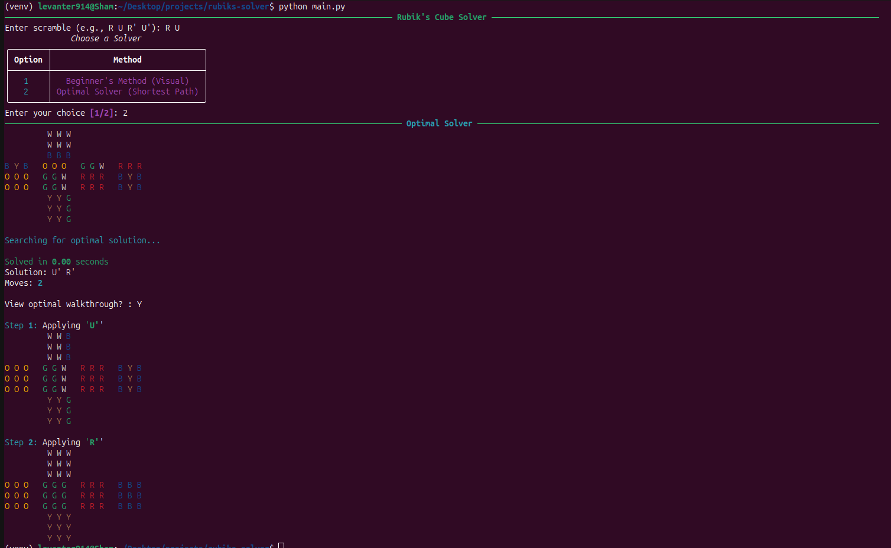
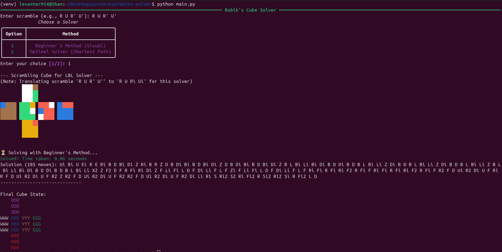

# Rubik's Cube Solver
𒅒𒈔𒅒𒇫𒄆
A Rubik’s Cube solver written in Python with two solving strategies:
- **Layer-by-Layer (LBL) Method** — educational, human-style solving.
- **Bidirectional BFS Optimized Solver** — faster, algorithmic solving using search.
𒅒𒈔𒅒𒇫𒄆
---

## Gallery




## Project Structure

```
rubiks-solver/
├── lbl\_solver/              # LBL-based solving logic
│   ├── cube.py              # Cube representation
│   ├── maths.py             # Math utilities (e.g. rotation logic)
│   ├── optimize.py          # Move optimizations (e.g. U+U' => identity)
│   └── solver.py            # Step-by-step LBL solver
├── optimized\_solver/        # Optimal solver using Bidirectional BFS
│   ├── optimal\_cube.py      # Minimal cube state representation
│   └── optimal\_solver.py    # Bidirectional BFS logic
├── main.py                  # Entrypoint for LBL solver
├── run\_solver.py            # Entrypoint for optimized solver
├── requirements.txt         # List of dependencies (currently minimal)
├── README.md                # You're here!
└── venv/                   

````

---

## Running the Solver

### 0. Setup (Optional but recommended)

```bash
python3 -m venv venv
source venv/bin/activate
pip install -r requirements.txt
python main.py
````

---

### 1. Run the LBL (Layer-by-Layer) Solver

> Choose 1

You’ll be prompted to run a predefined scramble and see it solved step-by-step.

---

### 2. Run the Optimized Solver (Bidirectional BFS)

> Choose 2

This uses `optimized_solver/` to find the **shortest move sequence** from a scrambled cube to a solved state using **Bidirectional Breadth-First Search**.

---

## Features

* Modular, clean Python implementation.
* Two solving approaches: human-style LBL and optimal BFS.
* Move optimizer to reduce unnecessary turns.
* Educational and beginner-friendly code structure.

---


## FAQ

### **How do the two solvers work?**

**Beginner’s (LBL) Solver:**
Follows a fixed 7-step method inspired by how humans solve a Rubik’s Cube. No search involved—just sequential, hardcoded logic (e.g. white cross → first layer → second layer, etc.).

**Optimal (BFS) Solver:**
Uses **bidirectional BFS** to find the shortest solution path. Treats each cube state as a node in a graph and expands outward from both the scrambled and solved states until they meet.

---

### **How is the cube modeled internally?**

**LBL Solver:**

* 54-sticker list + 26 `Piece` objects for logic.
* Tracks stickers and cubies separately.

**BFS Solver:**

* Uses a flat list/tuple of 54 stickers.
* Designed for fast hashing, comparison, and copying.

---

### **What data structures are used?**

**LBL:** Just a mutable `Cube` object. No search = minimal structures.
**BFS:**

* `deque` for efficient queueing in BFS.
* Two `dict`-based sets to store visited states from both ends.

---

### **Are moves simulated or predicted?**

Both solvers use **deterministic move engines** based on **permutation cycles**—each move swaps fixed sticker positions.

---

### **Which is faster? Which is better?**

| Solver | Speed             | Move Count             | Complexity |
| ------ | ----------------- | ---------------------- | ---------- |
| LBL    | ✅ Very fast       | ❌ Long (100–200 moves) | O(1)       |
| BFS    | ❌ Slower (varies) | ✅ Optimal              | O(b^(d/2)) |

